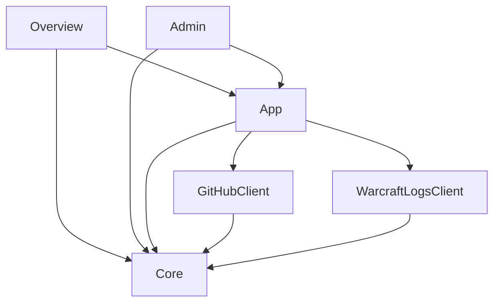

# DKP

## Design decisions

### Platform

- outsourcing the platform management, just giving the application code and configuration
- sadly cant use AWS App Runner, because websockets are not supported (needed by Streamlit)
- choosing Streamlit Community Cloud over Elastic Beanstalk
- cheap, easy to setup and manage

### Database

- dealing with json data only, so no relational database needed
- using AWS nosql database, mostly for educational reasons
- choosing DynamoDB over DocumentDB, because its cheap and easy to setup

### Database backup

- saving production data as files in github directory once a day, because no sensitive data exists
- can be reused for development, testing and database initialization
- using GitHub API for educational reasons

### Architecture

- form data validation happens in app, not in views
- clients don't contain any business logic
- data formats
  - dataframes for views
  - dataframes and list of dics for transformation/data-manipulation
  - json as storage format of data files (should be converted right before pushing to github.com)



## Setup local environment

### Python

```bash
conda create -n dkp python=3.12 -y
conda activate dkp

pip install pip-tools
pip-compile --all-extras pyproject.toml
pip-sync
pip install --editable=.[dev]  # installs dkp app incl. dev extras in edit mode (. indicates, where to find the setup file)
```

### Configuration

Dotenv file at "<workspace>/.env" with following content:

```bash
WCL_CLIENT_ID=...
WCL_CLIENT_SECRET=...
```

### Start locally

```bash
cd ~/Projects/private/dkp
python -m streamlit run src/dkp/01_overview.py
```

## Deployment on streamlit community cloud

- login to steamlit cloud: https://share.streamlit.io/
- new app
  - repo: `oliverfischer83/dkp`
  - branch: `main`
  - file: `src/dkp/01_overview.py`
  - url: `dkp-vipers.streamlit.app`
  - advanced:
    - python version: `3.12`
    - secrets (see keepass):

```shell
WCL_CLIENT_ID="..."
WCL_CLIENT_SECRET="..."
GITHUB_CLIENT_TOKEN="..."
ADMIN_PASSWORD="..."
```

- use pull requests for release from `develop` branch to `main` branch

# TODO

## Scenarios:

- Normal use case:
  - click Raid button: raid entry, status "started"
  - add report id (live log)
  - add loot: -> failed: unknown character
  - add character in editor
  - try again add loot: -> failed: invalid note
  - fix note in editor
  - try again add loot: -> succeeded
  - click on raid button: status "finished" (adds 50pt. to balance)

## misc

- fix: m+ chars in raid report, test with report vF2C8crAdja1QKhD
  - or show warning and abort if m+ logs in report
- find other cloud hosting as backup
- code quality
  - unit tests for balance functions
  - constants for string field names where possible
- loot statistics (which loot dropt how often, raid progress, raid attendence, ...)
- translation of bosses and raids into german
- protection for delete object


# Fallback Excel list

- after each raid, generate table entries which can be used within excel as a fallback solution
- RCLootCouncil not useable at all (through bug, or similiar)
  - add entries by hand on admin page, define simple default values for other fields of RawLoot
- No Masterlooter (ID already taken, cant distribute loot)
  - do auction like bidding and note down winner
  - get upload from someone else

# Refactor

- balance and loot-history should have an own data class
- unify methods
  - create_loot_log, update_loot_log, fix_loot_log
- unify data validation on export upload and loot editor changes

# Release info

- tagging releases
- show release info bottom of side pane
