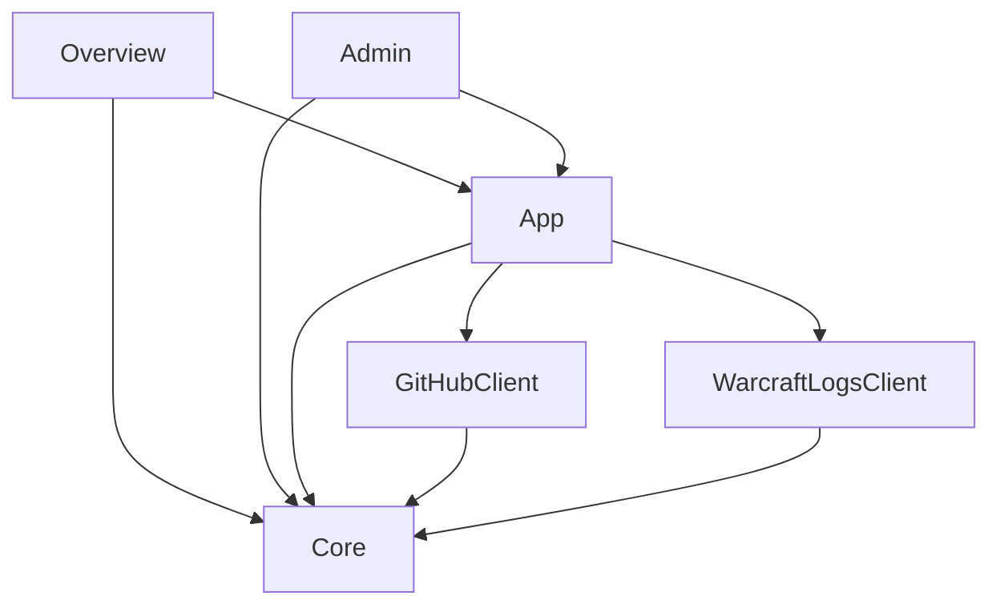

# DKP

## Design decisions

### Platform

- sadly cant use AWS App Runner, because websockets are not supported (needed by Streamlit)
- choosing Streamlit Community Cloud over Elastic Beanstalk
  - cheap, easy to setup and manage

### Database

- no relational database needed (json data files only)
- saving production data as files in github directory
  - no sensitive data exists
  - no dedicated database needed
  - audit log, high availability and backup feature given
  - can be reused for development, testing and database initialization

### Architecture

- form data validation happens in app, not in views
- clients don't contain any business logic
- data formats
  - dataframes for views
  - dataframes and list of dicts for transformation/data-manipulation
  - json as storage format of data files (should be converted right before pushing to github.com)



## Setup local environment

### Python

```bash
conda create -n dkp python=3.12 -y
conda activate dkp

pip install pip-tools
pip-compile --all-extras pyproject.toml
pip-sync
# installs dkp app incl. dev extras in edit mode (. indicates, where to find the setup file)
pip install --editable=.[dev]
```

### Configuration

Dotenv file at "<workspace>/.env" with following content:

```bash
WCL_CLIENT_ID=...
WCL_CLIENT_SECRET=...
```

### Start locally

```bash
cd ~/Projects/private/dkp
python -m streamlit run src/dkp/01_Guthaben.py
```

## Deployment on streamlit community cloud

- login to steamlit cloud: https://share.streamlit.io/
- new app
  - repo: `oliverfischer83/dkp`
  - branch: `develop`, `release`, `main`
  - file: `src/dkp/01_Guthaben.py`
  - url: `dkp-vipers.streamlit.app`
  - advanced:
    - python version: `3.12`
    - secrets (see keepass):

```shell
WCL_CLIENT_ID="..."
WCL_CLIENT_SECRET="..."
GITHUB_CLIENT_TOKEN="..."
ADMIN_PASSWORD="..."
BRANCH_NAME="..."  # develop, release, main
```

## Release process

- set correct version in `pyproject.toml` file, e.g. `0.1.0`
- merge `develop` into `release` branch
- create pull requests from `release` into `main` branch
- clean up `release` branch, no test data/files, keep ...
  - /media
  - /src
  - config.yml
  - LICENSE
  - pyproject.toml
  - README.md
  - requirements.txt
- test deploy on streamlit cloud
- squash commit
- create [new release](https://github.com/oliverfischer83/dkp/releases/new)

## Use cases:

- Normal use case:
  - start Raid
  - fulfill Checklist (add report id)
  - add loot -> failed: unknown character
  - add character in editor
  - try again add loot -> failed: invalid note
  - fix note in editor
  - try again add loot -> succeeded
  - finish Raid (adds 50pt. to balance)

## Desaster Plan

- App or Addon (RCLootCouncil) not available
  - cause:
    - App is buggy
    - App startup failed
    - Addon is buggy
    - Addon updated with incompatible export schema
  - solution:
    - use [Excel sheet](https://docs.google.com/spreadsheets/d/1bVRMxiiKN4kWlpDF9bvVprsjm8ucpHJ1TYGSAuDFO2c/edit?usp=sharing)
    - copy balance from `data/balance_fallback.csv` into Excel sheet
    - fix App and add loot later
- Masterlooter mode not usable
  - cause:
    - Character of masterlooter has already a raid ID and cannot collect the loot
  - solution:
    - someone else collects the loot
    - start session manually: `/rc add <item>`

# TODO

## misc

- fix: m+ chars in raid report, test with report vF2C8crAdja1QKhD
  - or show warning and abort if m+ logs in report
  - ignore all fights[x].size <= 9
- find other cloud hosting as backup
- translation of bosses and raids into german

# Statistics

- items
  - raid itemlevel over time
  - highest rolled
  - lowest drop rate
  - number of trash, number of rolled
- raid size over time
- boss kill timer over time


- try to get infos about
  - characterData: CharacterData
  - gameData: GameData